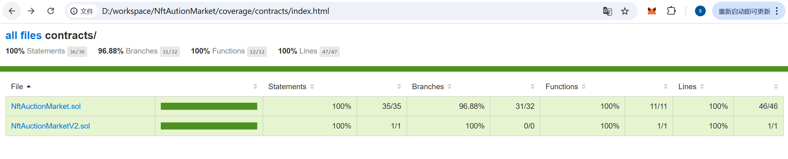

# 🏆 NFT Auction Market

一个基于以太坊智能合约的 NFT 拍卖市场平台。支持多种代币计价、价格预言机集成、合约升级等功能。

[](LICENSE)
[](https://solidity.readthedocs.io/)
[](https://hardhat.org/)


#### Sepolia测试网部署地址：   
实现合约地址： 0x1d7210c25E4ab7e8dcc83044d72aD16CE979bf95    
代理合约地址： 0x11956AEEB25D7739ddF0f0e7f1de906846aDc374    

#### 测试覆盖率和测试结果   
coverage/index.html


## 📋 目录

- [功能特性](#功能特性)
- [项目结构](#项目结构)
- [前置要求](#前置要求)
- [安装与配置](#安装与配置)
- [快速开始](#快速开始)
- [合约说明](#合约说明)
- [部署指南](#部署指南)
- [测试](#测试)
- [常见命令](#常见命令)

## ✨ 功能特性

- **NFT 拍卖**：创建和参与 NFT 拍卖竞价
- **多代币支持**：支持 ETH 和 ERC-20 代币计价
- **价格预言机集成**：使用 Chainlink 价格预言机进行实时价格转换
- **可升级合约**：采用 UUPS 代理模式支持合约升级
- **访问控制**：基于 OpenZeppelin 的 Ownable 模式进行权限管理
- **Gas 优化**：使用 Hardhat 进行 gas 报告和优化

## 📁 项目结构

```
NftAuctionMarket/
├── contracts/                      # Solidity 智能合约
│   ├── NftAuctionMarket.sol        # 主合约（v1）
│   ├── NftAuctionMarketV2.sol      # 升级版合约（v2）
│   └── test/                       # 合约内测试
├── test/                           # JavaScript 测试文件
│   ├── NftAuctionMarket.js         # 单元测试
|   └── Upgrade.js
├── deploy/                         # 部署脚本
├── coverage/                       # 测试覆盖率报告
├── hardhat.config.js              # Hardhat 配置文件
├── package.json                   # 项目依赖配置
└── README.md                      # 本文件
```

## 🛠️ 前置要求

- **Node.js** >= 18.x
- **npm** >= 9.x 或 **yarn** >= 3.x
- **Git**

## 📦 安装与配置

### 1. 克隆项目

```bash
git clone https://github.com/j66609083/NftAutionMarket.git
cd NftAutionMarket
```

### 2. 安装依赖

```bash
npm install
```

如果遇到 peer dependency 冲突，可以使用：

```bash
npm install --legacy-peer-deps
```

### 3. 环境配置

创建 `.env` 文件（可选，用于网络配置）：

```env
# Infura API Key（用于 Sepolia 测试网）
INFURA_API_KEY=your_infura_api_key

# 私钥（部署时使用）
PRIVATE_KEY=your_private_key
```

## 🚀 快速开始

### 编译合约

```bash
npx hardhat compile
```

### 运行测试

```bash
# 基础测试
npx hardhat test

# 带 Gas 报告的测试
REPORT_GAS=true npx hardhat test

# 测试覆盖率分析
npx hardhat coverage
```

### 本地节点

启动本地开发网络：

```bash
npx hardhat node
```

在另一个终端运行部署脚本：

```bash
npx hardhat deploy --network localhost
```

## 📝 合约说明

### NftAuctionMarket.sol（主合约）

**主要功能**：

1. **createAuction** - 创建 NFT 拍卖
   - 参数：拍卖持续时间、起拍价、NFT 合约地址、Token ID
   - 返回：拍卖 ID
   - 权限：任何地址

2. **bid** - 出价竞拍
   - 参数：拍卖 ID、出价金额
   - 要求：出价高于当前最高出价
   - 权限：任何地址

3. **endAuction** - 结束拍卖
   - 参数：拍卖 ID
   - 权限：仅卖家

4. **setPriceFeed** - 设置价格预言机
   - 参数：代币地址、预言机地址
   - 权限：仅合约所有者

### NftAuctionMarketV2.sol（升级版合约）

基于 V1 的功能增强版本，支持合约升级。

**关键特性**：
- 使用 UUPS 代理模式（可升级）
- 继承 `UUPSUpgradeable` 和 `OwnableUpgradeable`
- 向后兼容 V1 数据结构

## 🔧 部署指南

### 1. 部署到本地网络

```bash
npx hardhat deploy --network localhost
```

### 2. 部署到 Sepolia 测试网

**前置条件**：
- `.env` 文件中配置 `PRIVATE_KEY` 和 `INFURA_API_KEY`
- 账户拥有测试网 ETH（从 [faucet](https://sepoliafaucet.com/) 获取）

```bash
npx hardhat deploy --network sepolia
```

### 3. 使用 Hardhat Ignition 部署（暂不支持，后续完善）

Ignition 提供了声明式的部署方式：

```bash
npx hardhat ignition deploy ignition/modules/Lock.js --network sepolia
```

### 4. 验证合约

在 Etherscan 上验证合约源码（需要 API Key）：

```bash
npx hardhat verify --network sepolia <CONTRACT_ADDRESS> <CONSTRUCTOR_ARGS>
```

## 🧪 测试

项目包含完整的单元测试套件（`test/my-tests.js`），覆盖以下场景：

- ✅ 拍卖正确创建
- ✅ 出价逻辑验证
- ✅ 拍卖结束条件检查
- ✅ 权限控制（仅所有者可操作）
- ✅ 异常处理

运行测试：

```bash
# 基础测试
npx hardhat test

# 带输出详情的测试
npx hardhat test --verbose

# 测试覆盖率
npx hardhat coverage
```

## 📊 常见命令

| 命令 | 说明 |
|------|------|
| `npm install` | 安装项目依赖 |
| `npx hardhat compile` | 编译 Solidity 合约 |
| `npx hardhat test` | 运行所有测试 |
| `npx hardhat test --testNamePattern="<test_name>"` | 运行指定测试 |
| `REPORT_GAS=true npx hardhat test` | 运行测试并生成 Gas 报告 |
| `npx hardhat coverage` | 生成测试覆盖率报告 |
| `npx hardhat node` | 启动本地开发网络 |
| `npx hardhat run scripts/deploy.js` | 执行部署脚本 |
| `npx hardhat clean` | 清理编译文件和缓存 |
| `npx hardhat help` | 查看 Hardhat 帮助 |

## 📚 技术栈

- **智能合约框架**：[Hardhat](https://hardhat.org/)
- **合约库**：[OpenZeppelin Contracts](https://docs.openzeppelin.com/contracts/)
- **测试框架**：[Mocha](https://mochajs.org/) + [Chai](https://www.chaijs.com/)
- **代币标准**：ERC-721（NFT）、ERC-20
- **价格预言机**：[Chainlink](https://chain.link/)
- **代理模式**：UUPS（可升级代理标准）

## 🔐 安全考虑

- ✅ 使用 OpenZeppelin 标准库减少漏洞风险
- ✅ 合约使用 UUPS 代理支持紧急升级
- ✅ 实现访问控制防止未授权操作
- ✅ 建议在主网部署前进行审计

## 📄 许可证

UNLICENSED

## 👤 作者

[j66609083](https://github.com/j66609083)

## 💬 支持与反馈

如有问题或建议，欢迎提交 [Issue](https://github.com/j66609083/NftAutionMarket/issues) 或 PR。

---

**最后更新**：2025 年 11 月 22 日